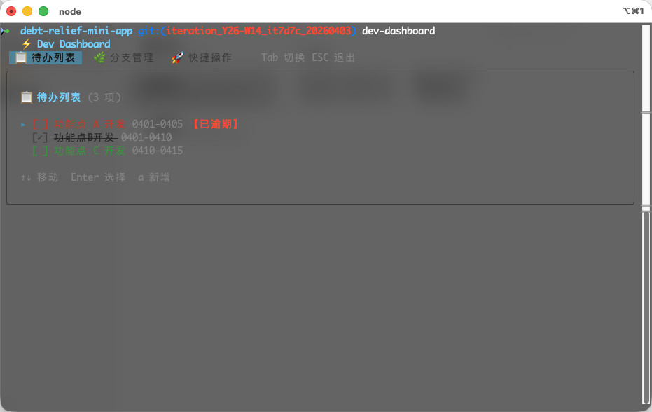
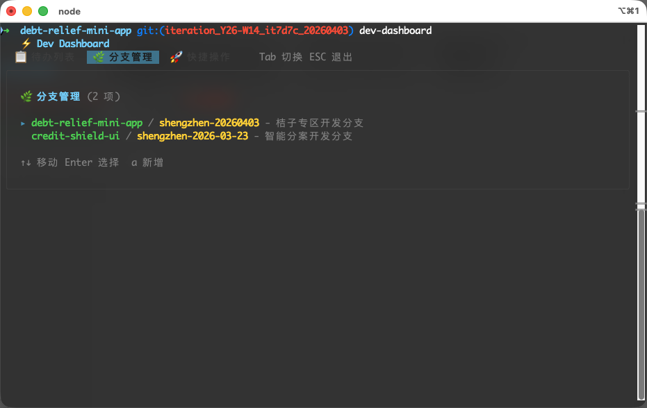
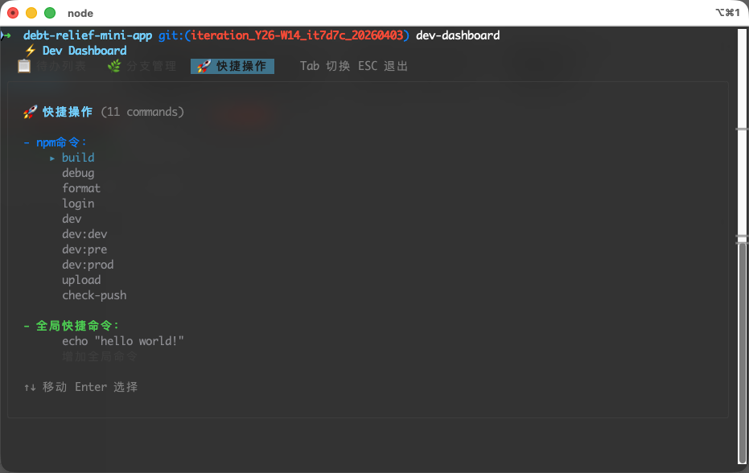
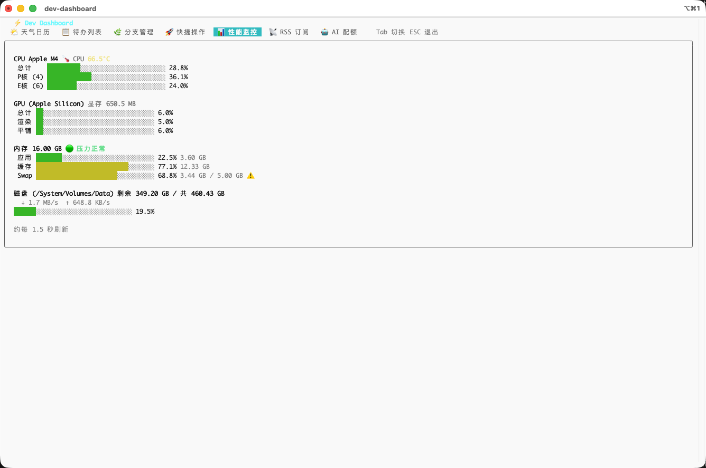

# ⚡ Dev Dashboard

一个使用 [Ink](https://github.com/vadimdemedes/ink) 和 React 构建的终端开发者仪表盘。直接在命令行中管理你的待办事项（TODO）、分支记录，查看 **CPU、内存与磁盘** 等性能信息、**RSS 订阅**，以及 **天气日历**。

## ✨ 功能特性

- **📋 待办列表 (Todo List)**: 以交互方式跟踪你的开发任务。支持添加、选择和管理待办事项。
- **🌿 分支管理 (Branch Management)**: 快速记录和管理你的分支信息。享受智能提示功能，可以立即在目标仓库中物理创建或删除真实的 Git 分支。
- **🚀 快捷操作 (Quick Actions)**: 内置的命令面板。自动加载本地 `package.json` 中的脚本，并允许你定义自定义全局命令，所有操作均可通过简单的按键执行。
- **📊 性能监控**: 实时查看 **CPU**、**内存** 占用率（进度条），以及当前工作目录所在卷的 **磁盘剩余空间 / 总容量**；磁盘进度条表示 **已用空间占比**。数据约每 1.5 秒刷新一次。
- **📡 RSS 订阅**: 管理你的 RSS 订阅源列表。选择订阅源后可查看文章列表（支持上下滚动、左右翻页），按 Enter 即可在浏览器中打开文章。支持新增、编辑和删除订阅源。
- **🌤️ 天气日历**: 显示当天公历日期、**农历日期**（含干支纪年/生肖）、实时时钟，以及未来天气预报（字符画图标 + 气温 + 风力）。天气数据由 [高德地图 API](https://lbs.amap.com/) 提供，首次使用需输入高德 Web 服务 API Key 和城市名称，配置保存在本地。
- **💻 交互式 CLI UI**: 优雅、对键盘操作友好的控制台用户界面，并且完全响应式。
- **⌨️ 现代终端增强支持**: 内置了对高级终端环境（ Kitty Keyboard Protocol）的支持，在支持的终端下能够完美识别和原生透传诸如 `Shift+Enter` (换行)、`Option+方向键` (跨单词/段落跳跃) 等高级组合快捷键。
- **📦 本地存储**: 你的数据会安全并持久地保存在本地路径 `~/.dev-dashboard-data.json` 下。

<!-- prettier-ignore-start -->

> [!WARNING]
> **终端兼容性提示**
>
> 由于目前各终端软件对底层系统 **Keyboard Protocol** 扩展协议的兼容性存在巨大差异（例如 macOS 原生终端程序 `Terminal.app` 不支持该协议），部分高级组合快捷键（如 `Shift+Enter` 等）在原生终端下可能会失效或退化。
>
> **🏆 为了保障本系统的各种高级快捷键组合体验达到最佳状态，强烈推荐使用具备该协议支持能力的 [iTerm2](https://iterm2.com/) 终端。**

<!-- prettier-ignore-end -->

## 📸 界面预览

### 待办列表



### 分支管理



### 快捷操作



### 性能监控



## 📦 安装

你可以通过 npm 全局安装它：

```bash
npm install -g @eater-altria/dev-dashboard
```

## 🚀 使用方法

只需输入以下命令即可启动仪表盘：

```bash
dev-dashboard
```

### ⌨️ 键盘快捷键

- `Tab` : 在待办列表、分支管理、快捷操作、性能监控、RSS 订阅和天气日历标签页之间循环切换。
- `↑` / `↓` : 在列表项中上下移动。
- `Enter` : 选择 / 确认操作。
- `a` : 添加新项目（待办项/分支）。
- `ESC` : 退回上一级或退出仪表盘。

## 🛠️ 开发指南

安装依赖并启动本地开发环境：

```bash
# 安装依赖
npm install

# 在监听模式下启动编译器
npm run dev
```

## 📝 许可证

MIT
